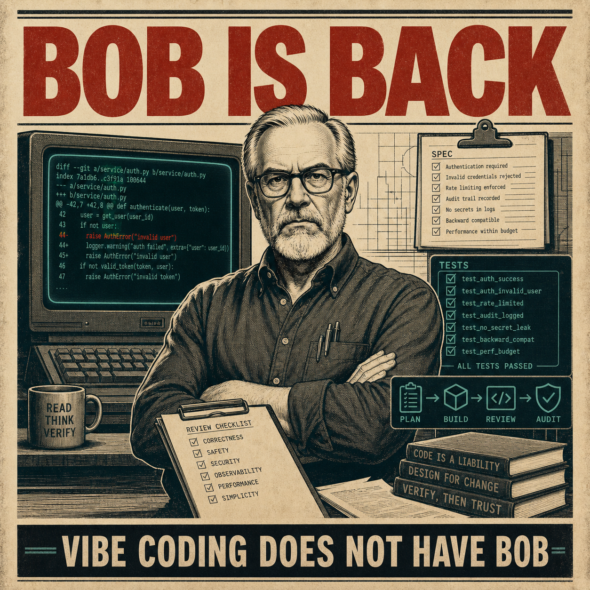

# Bob

<p align="center">
  
</p>

Software engineering used to have a guy named Bob. Bob's job was to
look at what you were doing, ask why, and tell you to slow the hell
down. Bob read the spec before the code. Bob read the code before the
commit. Bob read the commit before the deploy. Bob was annoying. Bob
was correct. I miss Bob.

Vibe coding does not have Bob.

This talk presents four tools that put Bob back.

Duplo is Bob creating the spec. Tell Duplo what you want, point it at a
product URL, drop in screenshots, PDFs, or a demo video, whatever you
have. Duplo produces a phased build plan. The quality of the output is
a direct function of the quality of the plan. This restores the
incentive to design carefully, a habit the field has been losing.

McLoop is Bob running, testing, and debugging the build while you sleep
or binge Netflix. It runs autonomous coding sessions for hours or days,
with fresh context per task, tests and lint after every change, and
only clean code committed. It will bug you if necessary. McLoop builds
what Duplo designed.

Orchestra is grumpy Bob fighting LLM slop. Any single LLM can fail
spectacularly. Bob doesn't like that. Orchestra gives different models
different jobs, then makes them argue, interact, and sing harmonies
before anything touches the workspace. Multi-model architectures are
not an optimization; they are how you get review, disagreement, and
judgment back into a process that is quickly losing them.

Vroom is Bob reading what shipped and asking what he should have done
differently. Vroom runs parallel auditors on your system, coalesces
their findings, and proposes a corrected or expanded version.
Eventually Vroom becomes Bob running the whole thing in a loop:
proposing changes on branches, gating them on verification, and merging
what survives. You can sleep through this.

Bring the kind of skepticism the field used to have before it fired
Bob.

Bob is in active use and development. Bob is built with Bob.

Subscribe at
[buttondown.com/bringbackbob](https://buttondown.com/bringbackbob)
for releases, demos, and first invitations to use it.

This repository is the umbrella for four tools that restore that loop:

- **Duplo** turns what you want into a design that can be
  implemented. Show it whatever reference material you have: a URL,
  a screenshot, a video, a paragraph, existing code. It produces a
  phased build plan ready for implementation.
- **McLoop** is your coding agent running for hours without you. Fresh
  context per task, tests and lint after every change, only clean code
  committed, automatic audits when the queue is done. You sleep, it
  ships.
- **Orchestra** runs multiple models per decision because one model is
  one opinion, and one opinion is how vibe-coded code escapes review.
  Drafting, critique, and reconciliation happen before any agent
  touches your workspace.
- **Vroom** asks the question Bob asks last: what should we have done
  differently? Parallel auditors against any artifact, multi-round
  refinement, a proposed correction.

In short: Duplo writes plans, McLoop executes them, Orchestra adds
counterpoint, and Vroom audits what survived.

## The Loop

```text
reference material
  -> Duplo: spec and phased plan
  -> McLoop: implementation, tests, commits
  -> Orchestra: multi-model review and judgment
  -> Vroom: audit, reflection, correction
  -> next plan
```

## Why This Exists

AI coding tools are powerful, but a single model acting alone is not a
software engineering process. It can skip design, miss edge cases,
hallucinate APIs, repeat bad approaches, and commit plausible nonsense.

Bob is the missing process layer:

- design before execution
- fresh context per task
- tests and lint after every change
- review before trust
- audit after shipping
- explicit recovery when something breaks

The point is not to make coding faster at any cost. The point is to
make autonomous coding slower where it should be slower, and faster
where it can be faster. The deeper point: return design to the
forefront of software engineering, where it lived before the field
stopped writing specs.

## Demo Flow

1. Start from a product URL, screenshot, PDF, video, or prose request.
2. Use Duplo to produce a spec and phased PLAN.md.
3. Use McLoop to execute the plan task by task.
4. Show tests, lint, commits, notifications, and crash recovery.
5. Use Orchestra to route a decision through multi-model disagreement.
6. Use Vroom to audit an artifact and propose a corrected version.
7. Close the loop: the corrected output becomes the next plan.

## Thesis

A coding agent is not a software engineering process.

Bob is the process:

- write and review the spec before the code
- write and review the code before the commit
- review the commit before the deploy
- make disagreement explicit
- verify what survived
- write down what should happen next

## Subscribe

Subscribe at
[buttondown.com/bringbackbob](https://buttondown.com/bringbackbob)
for releases, demos, and first invitations to use it. Announcements
only.

## Built By

Bob is built by [Michael Coen](https://github.com/mhcoen), a computer
scientist and ML researcher whose work spans software agents,
self-supervised learning, AI security, and LLM infrastructure. He
earned his S.B., S.M., and Ph.D. from MIT, received the Sprowls
Award for outstanding dissertation in computer science, was on the
faculty at the University of Wisconsin-Madison, and co-founded
several fintech startups.

His current work focuses on hardening AI systems and working toward
1,000 useful commits/day on GitHub.

## License

Each tool repository carries its own license. The narrative and
coordination material in this umbrella repository, including the
abstract, the loop description, and the framing of the Bob toolchain,
is copyright 2026 Michael Coen, all rights reserved.
